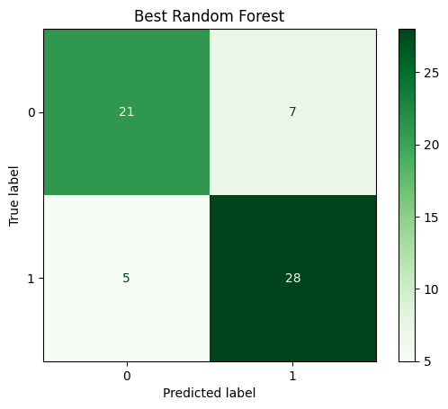
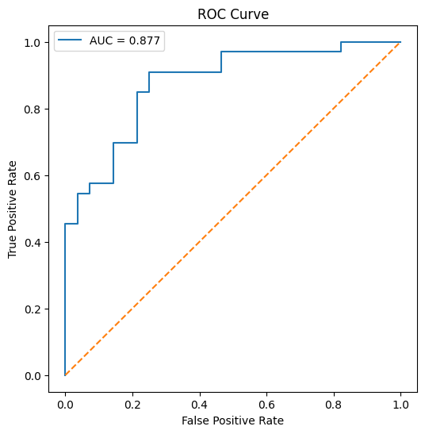
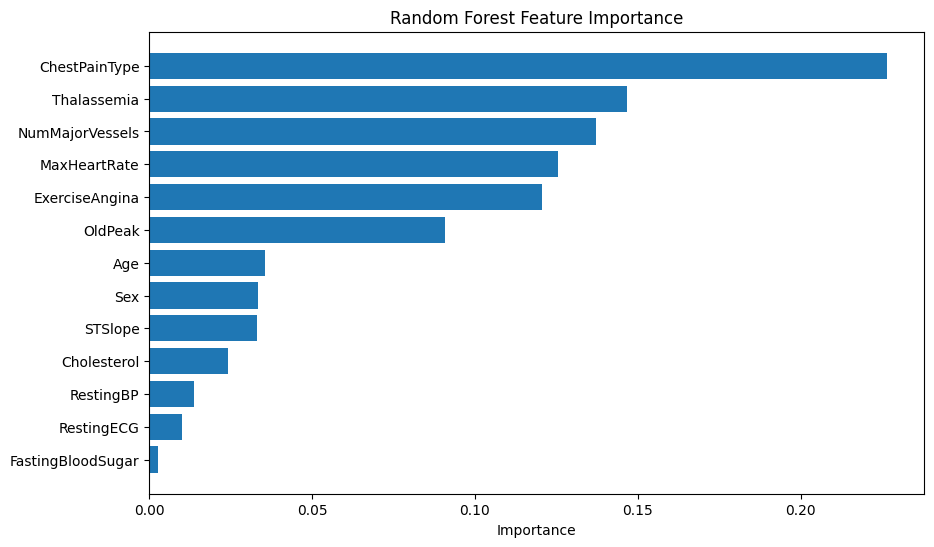

# Heart Disease Classification using Machine Learning

## Overview

This project demonstrates a complete machine learning workflow for predicting the presence of heart disease using clinical patient data.

The goal was not only to train a classification model, but to perform a complete data science pipeline including data exploration, preprocessing, feature analysis, model comparison, hyperparameter optimization and model evaluation.

The project was developed in Python using Scikit-learn and follows common machine learning practices used in biomedical data analysis.

## Dataset

The project uses the publicly available Heart Disease Dataset containing clinical measurements collected from patients.

Dataset characteristics:

- 302 unique patients
- 13 clinical input features
- Binary classification problem
- Target:
  - 0 = No Heart Disease
  - 1 = Heart Disease

Example features include:

- Age
- Sex
- Chest Pain Type
- Resting Blood Pressure
- Cholesterol
- Maximum Heart Rate
- Exercise Induced Angina
- ST Depression
- Number of Major Vessels
- Thalassemia

## Project Workflow

The complete machine learning pipeline includes:

### 1. Data Loading

- Loading dataset using Pandas
- Column renaming
- Dataset inspection

### 2. Exploratory Data Analysis (EDA)

Performed extensive exploratory analysis including:

- Dataset overview
- Descriptive statistics
- Histograms
- Class distribution
- Missing values analysis
- Duplicate detection

### 3. Data Cleaning

The dataset was cleaned by:

- Removing duplicated samples
- Checking missing values
- Verifying dataset consistency

### 4. Correlation Analysis

Pearson correlation analysis was performed to:

- Identify relationships between variables
- Analyze feature correlation with Heart Disease
- Visualize correlation heatmap

### 5. Feature Analysis

Feature distributions were investigated using:

- Boxplots
- Countplots
- Target-wise feature comparison

The analysis helped identify the most informative predictors.

### 6. Machine Learning Models

Two classification models were evaluated:

- Logistic Regression
- Random Forest Classifier

Performance was compared using:

- Accuracy
- Precision
- Recall
- F1-score
- Confusion Matrix

### 7. Hyperparameter Optimization

Random Forest was optimized using:

- RandomizedSearchCV
- 5-Fold Cross Validation

Optimized parameters included:

- Number of trees
- Tree depth
- Minimum samples per leaf
- Minimum samples for split
- Bootstrap
- Feature selection strategy

## Model Evaluation

The final model was evaluated using multiple performance metrics:

- Accuracy
- Precision
- Recall
- F1-score
- ROC Curve
- ROC-AUC
- Confusion Matrix
- Feature Importance

## Results

### Final Model

Random Forest Classifier

### Test Performance

- Test Accuracy: **80.3%**
  

- ROC-AUC (Test Set): **0.877**
  

### Hyperparameter Optimization

The Random Forest classifier was optimized using **RandomizedSearchCV** with **5-Fold Cross Validation** and ROC-AUC as the optimization metric.

Best hyperparameters:

- Number of Trees: **200**
- Maximum Depth: **3**
- Minimum Samples Split: **10**
- Minimum Samples Leaf: **4**
- Maximum Features: **log2**
- Bootstrap: **True**

Cross-Validation ROC-AUC:

**0.913**

## Most Important Features

Feature importance analysis identified the following variables as the strongest predictors of heart disease:

1. Chest Pain Type
2. Thalassemia
3. Number of Major Vessels
4. Maximum Heart Rate
5. Exercise-Induced Angina
6. Old Peak

## Technologies

- Python
- Pandas
- NumPy
- Matplotlib
- Seaborn
- Scikit-learn
- Joblib
